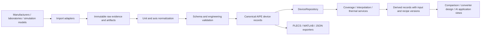

# AIPE Transistor Database — V3 foundation

AIPE is a Python data infrastructure layer for power semiconductors. It gives
manufacturer models, datasheets, laboratory measurements and derived results one
versioned semantic vocabulary, with explicit units, conditions and evidence lineage.
It supports future device comparison, converter evaluation and AI-assisted design.

The initial corpus contains **163 Wolfspeed SiC devices: 119 discrete models and
44 module models**. All original XML and the manufacturer guide are preserved.
The domain also supports Si MOSFET, IGBT and GaN identities, sample/lot distinctions,
multiple package components, reliability records and separate market observations.

## Architecture



`PowerSemiconductorDevice` composes small mostly immutable domain models. PLECS is
an adapter and an associated simulation model, not the database schema. Curves use
generic named axes and SI values, including four-dimensional gate-resistance tables.
External formulas and simulator bindings live only in model adapter metadata.

| Layer | Location / meaning |
| --- | --- |
| Raw | `data/raw/`: unchanged evidence with SHA-256 inventory |
| Canonical | `data/canonical/`: official schema 3.0.0 devices rebuilt from XML |
| Derived | `data/derived/`: calculations with input IDs, versions and recipes |
| Large artifacts | `ArtifactStore`: waveform URI, checksum, format and size |
| Legacy | `legacy/v1/`, `legacy/v2/`: migration sources, never runtime databases |

Small static curves belong in characteristic records. DPT waveform samples remain
in artifacts; metadata describes test runs, instruments, protocols, events and
derived metrics. Source and estimated records remain distinct. Repository updates
cannot replace or remove manufacturer/measured evidence; append a new record.

## Install and test

Python 3.11+ is required. Pydantic is the only core runtime dependency.

```bash
python3 -m venv .venv
source .venv/bin/activate
python -m pip install -e '.[dev]'
pytest -q
ruff check src tests scripts
ruff format --check src tests scripts
```

For runtime only, use `pip install -e .`. MATLAB export needs `.[matlab]` (SciPy).
Source datasets stay in the checkout and are not bundled into the Python wheel.

## Query and export

Run examples from the repository root:

```python
from aipe_devices.repository.json_repository import JsonDeviceRepository
from aipe_devices.services.coverage import CoverageAnalyzer
from aipe_devices.exporters.plecs import PlecsExporter

repo = JsonDeviceRepository("data/canonical")
device = repo.get("wolfspeed_c2m0025120d")
print(device.identity.part_number)
print(CoverageAnalyzer().analyze(device))
print([d.device_id for d in repo.search("C2M0025")])
xml = PlecsExporter().export(device, "data/derived/C2M0025120D.xml")
```

```python
from aipe_devices.exporters.json import JsonExporter
from aipe_devices.domain.device import PowerSemiconductorDevice
from aipe_devices.exporters.matlab import MatlabExporter

text = JsonExporter().export(device)
assert PowerSemiconductorDevice.model_validate_json(text) == device
MatlabExporter().export(device, "data/derived/C2M0025120D.mat")
```

## Import PLECS and migrate

```python
from aipe_devices.importers.plecs import PlecsImporter
from aipe_devices.schema.enums import Technology
from aipe_devices.services.validation import validate_device

device = PlecsImporter().load(
    "data/raw/wolfspeed/SiC/Wolfspeed/MOSFET with Diode/MOSFETs/C2M0025120D.xml",
    technology=Technology.SIC_MOSFET,
    integration="discrete",
)
report = validate_device(device)
report.raise_for_errors()
```

Technology and integration come from the known catalogue because XML alone does
not establish material or internal module topology. No ratings, gate voltages,
die counts or datasheet conditions are guessed from part numbers/comments.

```bash
aipe-devices import-wolfspeed data/raw/wolfspeed data/canonical --report docs/migration-report.json
aipe-devices migrate-legacy v1 legacy/v1 /tmp/aipe-v1-migration
aipe-devices migrate-legacy v2 legacy/v2 /tmp/aipe-v2-migration
```

Reimporting the official corpus verifies identical records; changed existing records
raise instead of being overwritten. Review alternative legacy migrations in separate
repositories. [Migration details](docs/migration.md) explain V2 information loss.

## Measurement partners

Partners receive a versioned `MeasurementRequest` and submit a `MeasurementPackage`
manifest with runs, source/access metadata and artifact references. Protocol version,
sample/lot identity, deskew, probe settings and processing recipes have dedicated
types. No waveform arrays are embedded in device JSON.

```bash
aipe-devices validate-package examples/measurement_package/manifest.json
python scripts/generate_examples.py
```

The example is explicitly **synthetic**, not a device characterization claim. See
[partner interface](docs/measurement.md), [example request](examples/measurement_request.json)
and [JSON Schemas](docs/schemas/). Validation checks references, recipes, optional
request coverage, artifact paths, sizes and checksums.

## Limitations and roadmap

- Source coverage is not engineering operating coverage. 900/1000 °C points remain
  in 742 curves; 24 curves in six devices have duplicate temperature coordinates.
  Reports expose both; interpolation rejects duplicate coordinates.
- PLECS adapters cover this corpus's tabulated MOSFET-with-diode dialect, including
  90 custom tables. Export requires explicit adapter bindings. Unknown custom-table
  semantics are rejected. No formula execution or simulator/XSD validation is claimed.
- Ratings, capacitance, gate charge, SOA, reliability and internal module connectivity
  generally remain unknown. Synthetic fixtures exercise other technology schemas only.
- Basic 1D interpolation and thermal DC resistance are implemented. Converter loss,
  fitting and waveform processing are extension contracts, not production solvers.
- JSON persistence has atomic files and an exclusive writer lock. No distributed
  database, cloud backend or authorization engine is included.
- No PDF digitization, SPICE parsing, laboratory control, lifetime prediction,
  distributor APIs or AI missing-data reconstruction.

Phase 2 should resolve source-axis ambiguities, add reviewed operating envelopes and
multidimensional evaluations, validate exports in PLECS, implement DPT processing and
artifact backends, and add measured/rating/capacitance datasets. See
[architecture](docs/architecture.md), [audit](docs/audit.md),
[deliverables](docs/refactor-report.md), [breaking changes](CHANGELOG.md)
and [licensing notes](LICENSING.md).
