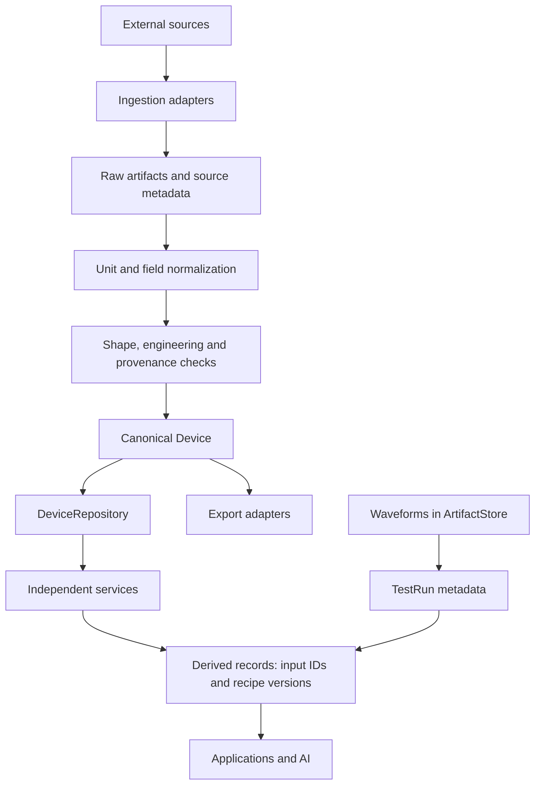

# V3 architecture and invariants

## Domain boundaries

`PowerSemiconductorDevice` composes identity, classification, ratings, package, source
catalogue, quality, characteristic groups, thermal/reliability records and model/test
references. It has no working-point state or simulator methods. Services depend on
domain models; repository/artifact protocols isolate storage. Adapters depend inward.

One `schema_version`, currently 3.0.0, governs serialization. Pydantic models reject
unknown fields/nonfinite numbers and use frozen attributes/tuple collections. Opaque
adapter metadata is the deliberately mutable dictionary exception; repository writes
revalidate serialized models. `model_copy(update=...)` is a trusted internal operation,
so use validated constructors for untrusted changes.

## Identity, quantities and missingness

Assigned device IDs are not constrained to manufacturer+part. Family, part, revision,
lot and physical-sample IDs may independently be populated. Test runs also carry
sample/lot references. Part-level models and sample-level measurements can coexist.

`ScalarRecord` combines a named quantity, operating condition, statistic, uncertainty,
quality and provenance. Known conditions have unit-checked fields; extensions are
named quantities. Statistics distinguish typical/min/max/mean/median/standard
deviation/unspecified. Missing uncertainty remains null.

Canonical absolute temperature is K, charge C, thermal resistance K/W, thermal
capacitance J/K, energy J, resistance Ohm. Celsius input is `degC`; PLECS axes convert
to K on import and back on export. Conversion requires an explicit unit, never a guess.

Characteristic groups distinguish available, partial, missing, not-applicable and
unknown. Absent historical groups default unknown. Thermal/reliability empty collections
map to unknown coverage in Phase 1. Availability means evidence presence, not coverage
of all operating points. Optional requirement sets identify partial coverage;
application-specific envelopes are deferred.

## Curves and modules

Curves are dense tensors: ordered named/unit-bearing axes and flattened values, last
axis fastest. Shape checks require product(axis lengths) to equal value count. Dynamic
waveforms always use artifact references. Manufacturer custom switching tables become
`[gate resistance, junction temperature, dc bus voltage, current]` tensors.

Packages contain optional components with die counts, device references and terminals,
parasitic scalar records and thermal-coupling references. The Wolfspeed catalogue labels
modules but does not establish their topology; unknown details remain empty.

## Evidence and lifecycle

Sources identify suppliers/labs/papers/AIPE/distributors and include artifacts and rights.
Every important record carries source IDs resolved against the device catalogue.
Cross-device/test dependencies have IDs, versions and optional checksums. Device
validation cannot resolve a remote registry; measurement-package validation resolves
local dependencies and explicitly declared external dependencies.

Lifecycle distinguishes raw, normalized, validated, canonical, derived and application
view. The PLECS adapter normalizes without persisting an intermediate database; the
batch importer validates before saving. Canonical means accepted semantic representation,
not that model data is measured or its entire physical range is verified.

Estimated/derived origins require upstream dependencies and derived/application-view
lifecycle. Recipe IDs and versions are paired. Interpolation returns new records.
Repository updates reject removal/replacement of source evidence, even if a replacement
uses a different ID. Corrections append new records. `invalidate()` marks the transitive
closure of changed input/recipe IDs stale; callers persist the result. No reactive
dependency engine is implied.

## Validation

- Structural checks: required fields, types, enums, finite numbers, shape and units.
- Engineering checks: source references, IDs, signs, ordered axes, thermal references.
- Negative signed conduction voltages are allowed.
- Decreasing axes are errors. Duplicate manufacturer-model coordinates warn and remain
  intact; non-model duplicates are errors. Interpolation always requires unique axes.
- Source points above 500 °C warn; they never imply a device temperature rating.
- Measured records without test references warn. Missing sample/ratings/uncertainty
  are never fabricated. All corpus issues are in `migration-report.json`.

## Persistence and adapters

JSON repository save is create-only. Update requires the expected revision plus one,
and preserves existing evidence/source records. Atomic file replacement and a directory
lock exclude concurrent writers. A crash may leave `.write-lock`; confirm no writer
is active before removing it. Distributed transactions are out of scope.

LocalArtifactStore uses SHA-256 content addressing and checks size/hash on reads.
Raw catalogue URIs `raw:wolfspeed/...` resolve relative to `data/raw/`; these are evidence
references, not local-store URIs. Partner paths are relative to package root. A future
ingest process may put those bytes into any ArtifactStore and remap references without
changing domain types. The current interface accepts bytes, not streaming uploads.

PLECS model references carry bindings: curve IDs, source scales, methods, formulas,
variables and comments. Export rebuilds from canonical tensors, not V1 JSON or raw XML.
Recognized four-axis expressions establish unit semantics; unknown custom tables are
rejected. Missing legacy lookup tables prevent complete export. No formula is executed.

MATLAB export includes a V3 struct and lossless canonical JSON string, since MATLAB
empty arrays cannot distinguish every null/empty case. The schema is independent of MAT.

## Extensions

Reliability types cover power/thermal cycling, HTRB/HTGB, short-circuit, avalanche,
aging, failure-rate and mission-profile metrics. MarketObservation is an independent
time series with quantity/currency/stock/lead-time/source; prices are not device constants.

Coverage, invalidation, bounded 1D interpolation, coverage comparison and thermal DC
resistance are implemented. LossEvaluator, ModelFitter, WaveformProcessor, MarketRepository
and datasheet/SPICE importers are contracts. No production solver, filtering, lifetime
prediction or full module transient model is implied.
